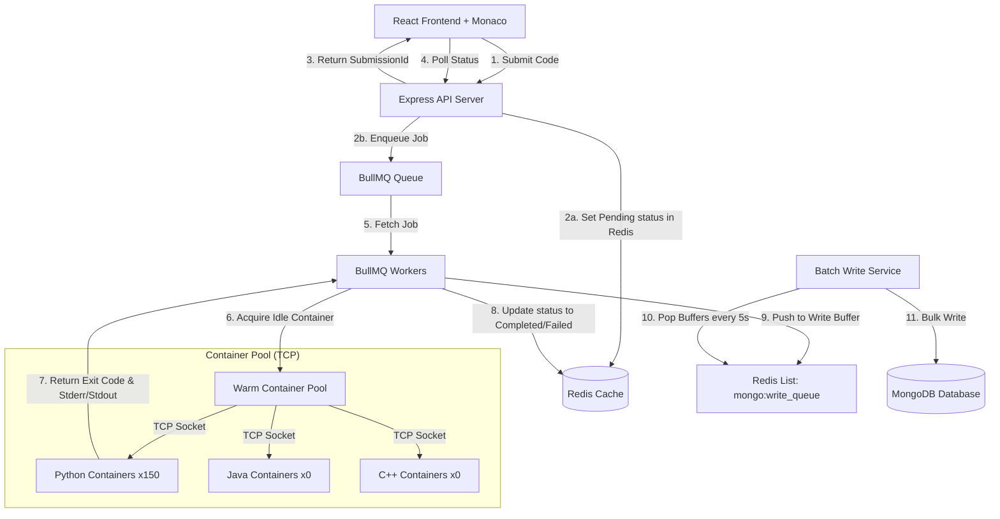

# LeetCode-Style Code Execution & Judging Engine

An integration-ready, high-performance execution engine designed to compile and run untrusted user code (Python, Java, C++) securely, precisely, and at scale. It utilizes isolated container sandboxes, a pre-warmed TCP container pool, an asynchronous queueing system (BullMQ + Redis), and a batch-write database layer.

---

## 🏗️ Architecture Design

The engine divides execution into two key pipelines: **Fast Ingestion** (synchronous API response) and **Isolated Judging** (asynchronous processing).



### Architectural Components

1. **Ingestion API (Express):** Receives code submissions, validates inputs, generates unique identifiers, and coordinates tasks.
2. **Queueing System (BullMQ + Redis):** Buffers incoming submissions to shield database and CPU resources from spikes.
3. **Worker Pool (BullMQ Workers):** Picks up queued jobs and orchestrates their isolation lifecycle.
4. **Warm Container Pool (TCP):** A pre-initialized pool of Docker containers listening on internal TCP sockets. Code is sent to the warm compilers/interpreters via binary buffers, eliminating container startup latency.
5. **Batch Mongoose Writer:** Offloads direct database writes. Results are pushed to a Redis list and written to MongoDB in bulk every 5 seconds, preventing write locks and socket exhaustion under high concurrency.

---

## 🛠️ Technology Stack

* **Frontend:** React.js, Monaco Editor, Tailwind CSS, Axios.
* **Backend:** Node.js, Express.js.
* **Database & Cache:** MongoDB (Mongoose ODM), Redis (caching and BullMQ state).
* **Asynchronous Queue:** BullMQ (Redis-backed job scheduler).
* **Virtualization & Security:** Docker (using Alpine/Ubuntu-based slim images with dropped privileges, cgroup limitations, and custom security options).

---

## ⚡ Core Engine Features & Optimizations

### 1. Warm Container Pool via TCP
Instead of spawning a new Docker container on every execution—which adds $15\text{s}$ to $35\text{s}$ of VM/container startup overhead—containers are kept running in a warm pool. Node communicates with the container's execution daemon using raw TCP sockets, reducing startup overhead to **$<10\text{ms}$**.

### 2. In-Sandbox Execution Timing
To prevent container startup or network latency from falsifying execution times, metrics are measured directly inside the compilers/interpreters around the user's entry point:
* **Python:** Evaluated using `time.perf_counter()`.
* **Java:** Evaluated using `System.nanoTime()`.
* **C++:** Evaluated using `std::chrono::high_resolution_clock`.

The timing is written to a dedicated `EXECUTION_TIME_MS:XXX` stderr marker parsed by the backend.

### 3. Host-Side Reference Execution
To evaluate custom test cases from users, a python reference solution is run directly on the host using `child_process.spawn` (instead of mounting containers). This generates expected outputs for custom parameters in **$<10\text{ms}$**.

### 4. Sequential Batch Judging
To prevent local CPU/Memory starvation, test cases for a single submission are executed sequentially rather than in parallel inside the sandbox. This eliminates false-positive Time Limit Exceeded (TLE) errors.

---

## 📡 API Reference

All requests accept and return JSON payloads.

### 1. List Problems
* **Endpoint:** `GET /api/coding/problems`
* **Description:** Retrieves the list of all published problems with basic difficulty and topic tags.
* **Response Example (200 OK):**
  ```json
  {
    "problems": [
      {
        "_id": "6a507deb14d38300e6711caa",
        "title": "Continuous Subarray Sum",
        "slug": "continuous-subarray-sum",
        "difficulty": "Medium",
        "topic": ["Arrays"]
      }
    ]
  }
  ```

---

### 2. Get Problem Details
* **Endpoint:** `GET /api/coding/problems/:problemId`
* **Description:** Retrieves problem descriptions, starter code configurations, and visible sample test cases.
* **Response Example (200 OK):**
  ```json
  {
    "problem": {
      "_id": "6a507dea14d38300e6711acc",
      "title": "Two Sum",
      "slug": "two-sum",
      "difficulty": "Easy",
      "topic": ["Arrays"],
      "description": "Given an array of integers nums and an integer target...",
      "constraints": ["2 <= nums.length <= 10^4"],
      "starterCode": {
        "python": "class Solution:\n    def twoSum(self, nums: List[int], target: int) -> List[int]:\n        pass"
      }
    },
    "sampleCases": [
      {
        "input": "{\"nums\": [2,7,11,15], \"target\": 9}",
        "expectedOutput": "[0,1]",
        "order": 1
      }
    ]
  }
  ```

---

### 3. Execute Custom Input
* **Endpoint:** `POST /api/coding/run`
* **Description:** Compiles and runs user code against a custom input parameter inside the container sandbox.
* **Request Payload:**
  ```json
  {
    "problemId": "6a507dea14d38300e6711acc",
    "language": "python",
    "code": "class Solution:\n    def twoSum(self, nums, target):\n        return [0, 1]",
    "input": "{\"nums\": [2,7,11,15], \"target\": 9}"
  }
  ```
* **Response Example (200 OK):**
  ```json
  {
    "output": "[0, 1]",
    "error": null
  }
  ```

---

### 4. Execute Batch/Test Suite (Run Code)
* **Endpoint:** `POST /api/coding/run/batch`
* **Description:** Evaluates user code against visible sample cases plus custom test cases. Compares outputs with host-side reference calculations.
* **Request Payload:**
  ```json
  {
    "problemId": "6a507dea14d38300e6711acc",
    "language": "python",
    "code": "class Solution:\n    def twoSum(self, nums, target):\n        return [0, 1]",
    "customCases": [
      { "input": "{\"nums\": [3, 2, 4], \"target\": 6}" }
    ]
  }
  ```
* **Response Example (200 OK):**
  ```json
  {
    "sampleResults": [
      {
        "input": "{\"nums\": [2,7,11,15], \"target\": 9}",
        "expectedOutput": "[0, 1]",
        "output": "[0, 1]",
        "error": null,
        "verdict": null,
        "passed": true,
        "runtimeMs": 35
      }
    ],
    "customResults": [
      {
        "input": "{\"nums\": [3, 2, 4], \"target\": 6}",
        "expectedOutput": "[1, 2]",
        "output": "[0, 1]",
        "error": null,
        "verdict": null,
        "passed": false,
        "runtimeMs": 30,
        "hasReference": true
      }
    ]
  }
  ```

---

### 5. Submit Code (Hidden Case Judging)
* **Endpoint:** `POST /api/coding/submit`
* **Description:** Asynchronously runs code against all hidden test cases. Pushes the job to the BullMQ queue and returns a pending status tracking ID.
* **Request Payload:**
  ```json
  {
    "problemId": "6a507dea14d38300e6711acc",
    "language": "python",
    "code": "class Solution:\n    def twoSum(self, nums, target):\n        seen = {}\n        for i, n in enumerate(nums):\n            if target - n in seen: return [seen[target - n], i]\n            seen[n] = i\n        return []"
  }
  ```
* **Response Example (200 OK):**
  ```json
  {
    "submissionId": "6a50ea7bfac78eb9b4ec922d",
    "status": "Pending"
  }
  ```

---

### 6. Retrieve Submission Status (Real-time status check)
* **Endpoint:** `GET /api/coding/submissions/status/:submissionId`
* **Description:** Polls the real-time status of a submission. Reads directly from the fast Redis cache (returning `Pending` or `Processing`) or falls back to MongoDB once complete.
* **Response Example - Pending (200 OK):**
  ```json
  {
    "status": "Pending"
  }
  ```
* **Response Example - Completed (200 OK):**
  ```json
  {
    "status": "Completed",
    "result": {
      "verdict": "Accepted",
      "passed": 15,
      "total": 15,
      "runtime": "45ms",
      "submissionId": "6a50ea7bfac78eb9b4ec922d",
      "failedTest": null
    }
  }
  ```

---

### 7. List Submission History
* **Endpoint:** `GET /api/coding/submissions`
* **Description:** Lists recent submissions made on the platform. Can optionally filter by `problemId` query.
* **Response Example (200 OK):**
  ```json
  {
    "submissions": [
      {
        "_id": "6a50ea7bfac78eb9b4ec922d",
        "problemId": {
          "_id": "6a507dea14d38300e6711acc",
          "title": "Two Sum",
          "slug": "two-sum",
          "difficulty": "Easy"
        },
        "verdict": "Accepted",
        "passed": 15,
        "total": 15,
        "runtimeMs": 45,
        "submittedAt": "2026-07-12T00:00:00.000Z"
      }
    ]
  }
  ```

---

## 🚦 Installation & Server Setup

### 1. Setup Environment Configuration
Create a `.env` file in the `backend/` directory:
```bash
PORT=5000
MONGODB_URI=mongodb://127.0.0.1:27017/coding_platform
REDIS_HOST=127.0.0.1
REDIS_PORT=6379
CLIENT_ORIGIN=http://localhost:5173
```

### 2. Run Database & Cache Containers
Run Redis and MongoDB containers on the host system:
```bash
# Start MongoDB Container
docker run -d --name coding-mongo -p 27017:27017 -v coding-mongo-data:/data/db mongo-runner:7.0

# Start Redis Container
docker run -d --name redis-bullmq -p 6379:6379 redis:latest
```

### 3. Build Sandbox Runner Images
Generate the execution sandbox images locally:
```bash
cd backend
npm run build:runners
```

### 4. Seed the Database
Populate problems and test cases in your MongoDB database:
```bash
npm run seed:json
```

### 5. Start Backend Server
```bash
npm install
npm run dev
```

### 6. Start Frontend App
In a new terminal window:
```bash
cd frontend
npm install
npm run dev
```
Open `http://localhost:5173` to interact with the frontend.
