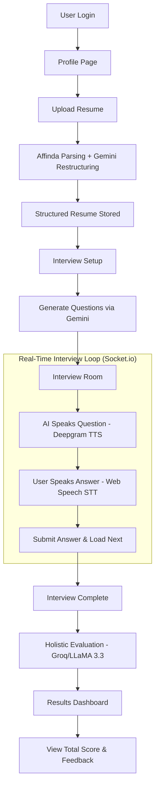

# 🎙️ Intervue | AI-Powered Mock Interview Platform

Intervue is a cutting-edge, end-to-end AI mock interview system designed to help candidates prepare for technical and behavioral interviews. By leveraging state-of-the-art Large Language Models (LLMs) and Speech APIs, Intervue provides a realistic, real-time interview experience with holistic feedback.

---

## 🚀 Key Features

- **📄 Intelligent Resume Parsing**: Upload your PDF resume; parsed via **Affinda** and restructured into a clean schema by **Gemini 1.5 Flash**.
- **🤖 Dynamic Question Generation**: AI analyzes your specific skills, experience, and projects to generate 8-9 tailored interview questions across multiple rounds (Technical, Behavioral, Project-based).
- **🗣️ Real-time Bidirectional Voice**: 
    - **AI Voice**: Questions are read aloud using **Deepgram Aura TTS** (high-fidelity, low-latency).
    - **Candidate Voice**: Speak your answers directly in the browser via **Web Speech API** (SpeechRecognition) with live transcriptions.
- **📊 Holistic Evaluation**: After the interview, **Groq (LLaMA 3.3 70B)** analyzes the entire transcript to provide a total score (out of 10), detailed feedback for each answer, and areas for improvement.
- **👤 Premium Dashboard**: View your interview history, overall scores, and deep-dive into AI evaluations for every past session.
- **🔐 Secure Auth**: Multi-provider authentication (Local, Google, GitHub) via **Passport.js**.

---

## 🛠️ Tech Stack

| Layer | Technologies |
|---|---|
| **Frontend** | Vanilla HTML5, JavaScript (ES6+), Tailwind CSS |
| **Backend** | Node.js, Express.js |
| **Database** | MongoDB (Mongoose) |
| **Real-time** | Socket.io |
| **AI Evaluation** | Groq (LLaMA 3.3 70B), Google Gemini 1.5 Flash |
| **Speech** | Deepgram Aura (TTS), Web Speech API (STT) |
| **Resume Parsing** | Affinda API |

---

## 📁 Project Structure

```plaintext
Intervue/
├── Backend/
│   ├── src/
│   │   ├── config/         # Passport, Socket.io, DB configs
│   │   ├── controllers/    # Business logic (Auth, Interview, Resume)
│   │   ├── models/         # Mongoose Schemas (User, Resume, Session)
│   │   ├── routes/         # Express API endpoints
│   │   ├── services/       # External API integrations (Gemini, Deepgram, Groq)
│   │   ├── sockets/        # Real-time interview event handlers
│   │   └── server.js       # Entry point
├── Frontend/               # Pure HTML/JS/CSS assets
│   ├── index.html          # Landing Page / Login
│   ├── Profile.html        # User Dashboard & Resume History
│   ├── Interview.html      # Session Setup (Role/Experience selection)
│   ├── InterviewRoom.html  # Live Interview Interface
│   └── Dashboard.html      # Post-Interview AI Results
└── readme.md
```

---

## ⚙️ Setup & Installation

### 1. Clone the repository
```bash
git clone <repo-url>
cd Intervue
```

### 2. Install Dependencies
```bash
cd Backend
npm install
```

### 3. Environment Variables
Create a `.env` file in the `Backend` directory:
```env
PORT=3000
MONGO_URI=your_mongodb_connection_string
secretKey=your_session_secret

# AI APIs
GEMINI_API_KEY=your_google_gemini_key
GROQ_API_KEY=your_groq_llama_key
DEEPGRAM_API_KEY=your_deepgram_key

# Resume Parsing
AFFINDA_API_KEY=your_affinda_key
AFFINDA_WORKSPACE=your_workspace_id

# OAuth (Optional)
GOOGLE_CLIENT_ID=...
GOOGLE_CLIENT_SECRET=...
GITHUB_CLIENT_ID=...
GITHUB_CLIENT_SECRET=...
```

### 4. Run the Application
```bash
npm run dev
```
Open **http://localhost:3000** in your browser (Chrome/Edge recommended for Speech API support).

---

## 🔄 Workflow Tree



---

## 👨‍💻 Author
Built with a focus on real-time AI systems and premium user experience.