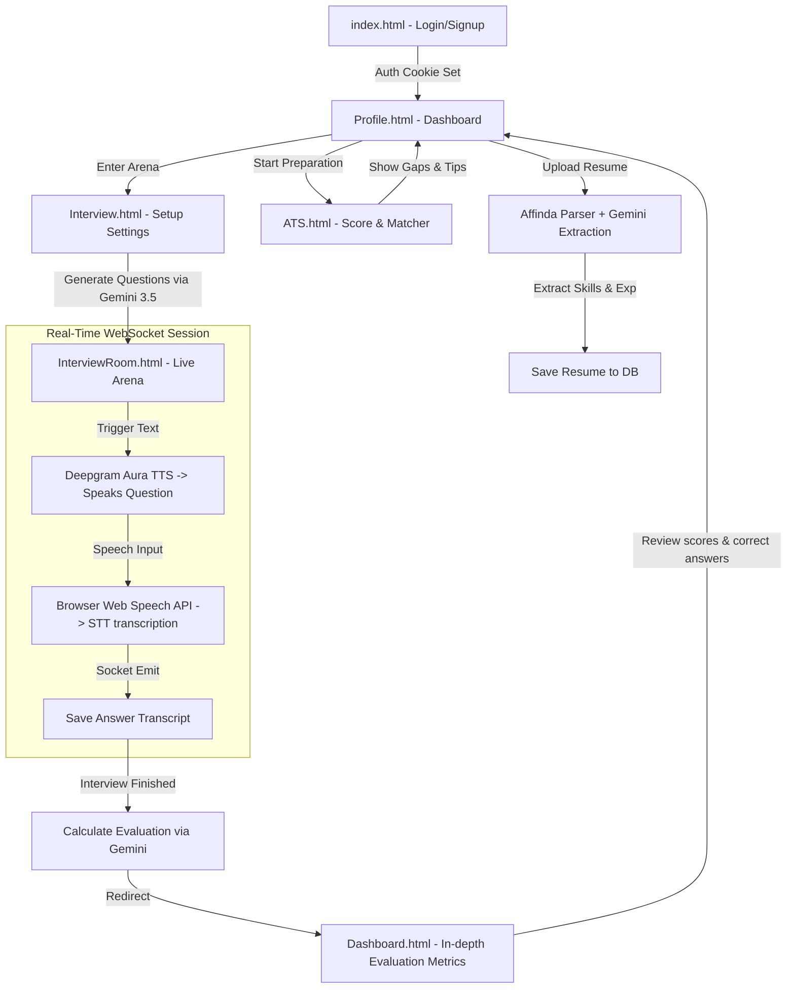

# 🎙️ Intervue | Modern AI Career Platform & Mock Interview Arena

Intervue is a premium, end-to-end **AI Career Copilot Suite** designed to prepare candidates for hiring pipelines. It is not just an ATS resume parser, but a comprehensive platform that helps users evaluate resume performance, identify skill gaps, experience realistic audio-driven mock interviews, and receive real-time granular feedback.

---

## 🚀 Core Features

### 1. 📄 ATS Resume Analyzer & Optimizer
* **Detailed Match Report**: Compares uploaded resumes against specific target job roles to calculate matching percentages for keywords, skills, experience, and formatting.
* **Skill Gap Identification**: Detects missing critical keywords (e.g., Docker, Kubernetes, CI/CD) and offers suggestions for measurable improvements.
* **Strengths & Feedback**: Outlines key candidate strengths (e.g., "Strong React Skills", "REST API experience") and practical suggestions to bypass applicant tracking filters.
* **Interface**: Beautifully structured layout via [ATS.html](file:///c:/Users/Administrator/OneDrive/Desktop/FC%20PROJECTS/Intervue/Frontend/ATS.html) powered by [ats.js](file:///c:/Users/Administrator/OneDrive/Desktop/FC%20PROJECTS/Intervue/Frontend/ats.js).

### 2. 🏟️ AI Mock Interview Arena
* **Immersive Interviews**: Simulate real interview panels for various target roles (e.g., Frontend Developer, Full Stack Engineer) and experience levels (Junior, Mid, Senior).
* **State-of-the-Art Generators**: Leverages Google's latest `gemini-3.5-flash` model in [interviewService.js](file:///c:/Users/Administrator/OneDrive/Desktop/FC%20PROJECTS/Intervue/Backend/src/services/interviewService.js) to dynamically generate context-aware questions from the candidate's resume and job criteria.
* **Setup UI**: Built using [Interview.html](file:///c:/Users/Administrator/OneDrive/Desktop/FC%20PROJECTS/Intervue/Frontend/Interview.html) and conducted inside [InterviewRoom.html](file:///c:/Users/Administrator/OneDrive/Desktop/FC%20PROJECTS/Intervue/Frontend/InterviewRoom.html).

### 3. 🗣️ Real-time Audio-Driven Conversational Loop
* **Natural Text-to-Speech**: AI questions are spoken aloud using **Deepgram Aura TTS** for high-fidelity, ultra-low-latency conversation.
* **Hands-free Speech-to-Text**: Candidate answers are captured directly through the browser using the **Web Speech API** (`SpeechRecognition`), showing a live transcript as they speak.
* **Fluid Exchange**: Conducted in real-time over persistent websocket connections powered by `Socket.io`.

### 4. 📊 Post-Interview Evaluation & Analytics
* **Holistic Scorecards**: Computes a total score out of 10, complete with clear metrics.
* **Granular Breakdown**: Reviews every single question with a side-by-side view showing the candidate's transcript, positive key points mentioned, missing points, and sample high-scoring answers.
* **Results UI**: Rendered beautifully in [Dashboard.html](file:///c:/Users/Administrator/OneDrive/Desktop/FC%20PROJECTS/Intervue/Frontend/Dashboard.html).

### 5. 🔐 Custom JWT Authentication
* **Stateful-free Security**: Replaced legacy session cookies with **custom JWT token authentication** using rotated access and refresh tokens.
* **Auto-rotation**: Access tokens are kept short-lived (15 minutes), and transparently rotated in the background via HttpOnly cookies using long-lived refresh tokens (7 days) without logging the user out.
* **Route Protection**: Administered globally via [authMiddleware.js](file:///c:/Users/Administrator/OneDrive/Desktop/FC%20PROJECTS/Intervue/Backend/src/middleware/authMiddleware.js).

---

## 🛠️ Technology Stack

| Layer | Technology | Description |
|---|---|---|
| **Frontend** | Vanilla JS (ES6+), Tailwind CSS, HTML5 | Modern SaaS aesthetic on [index.html](file:///c:/Users/Administrator/OneDrive/Desktop/FC%20PROJECTS/Intervue/Frontend/index.html) with HSL color systems, card styling, and custom typography. |
| **Backend** | Node.js, Express.js | Core API router and business logic handling. |
| **Database** | MongoDB (Mongoose) | Holds collections for User accounts, parsed Resume objects, and Interview Sessions. |
| **WebSockets** | Socket.io | Manages the live state of the Interview Room. |
| **AI LLM Engine** | Google Gemini SDK (`@google/genai`) | Drives resume parsing, question generation, and score calculations using `gemini-3.5-flash`. |
| **Speech Services** | Deepgram Aura API & Web Speech API | Provides voice integration for natural dialogue exchange. |

---

## 🔄 Core Application Workflow



---

## 📁 Repository Structure

```plaintext
Intervue/
├── Backend/
│   ├── src/
│   │   ├── config/         # Database and web socket setup
│   │   ├── controllers/    # Request handlers (Auth, ATS, Resume, Interview)
│   │   ├── middleware/     # Custom guards (JWT cookie parser and token rotator)
│   │   ├── models/         # MongoDB Mongoose schemas (User, Resume, Session)
│   │   ├── routes/         # REST API endpoints (Auth, Resume, Interview, Submissions)
│   │   ├── services/       # Integration layers (Gemini SDK, Deepgram, Groq)
│   │   ├── sockets/        # Socket handlers for running mock interviews
│   │   └── server.js       # App entry point
│   └── package.json
├── Frontend/               # Premium Light-Theme UI Assets
│   ├── index.html          # Dynamic SaaS Landing Page
│   ├── ATS.html            # ATS Resume Diagnostic Tool
│   ├── Interview.html      # Target Role & Level Setup Form
│   ├── InterviewRoom.html  # Live Audio Mock Interview Suite
│   ├── Profile.html        # User Dashboard & Session History
│   ├── Dashboard.html      # Holistic evaluation dashboard
│   ├── Profile.js          # Handles profile details and session listings
│   └── index.css           # Custom styling tokens
└── readme.md               # Project documentation
```

---

## ⚙️ Quick Setup & Installation

### 1. Clone & Initialize
```bash
git clone <repository-url>
cd Intervue
```

### 2. Configure Environment variables
Navigate to the `Backend` directory and create a `.env` file:
```env
PORT=3000
MONGO_URI=mongodb+srv://<username>:<password>@cluster.mongodb.net/intervue
ACCESS_TOKEN_SECRET=your_jwt_access_secret_key_here
REFRESH_TOKEN_SECRET=your_jwt_refresh_secret_key_here

# Google Gemini API
GEMINI_API_KEY=AIzaSy...

# Deepgram Aura (TTS)
DEEPGRAM_API_KEY=your_deepgram_api_key_here


### 3. Launch Development Server
Instantly start the application using `npm run dev`:
```bash
cd Backend
npm install
npm run dev
```
Once initialized, navigate to **`http://localhost:3000`** in your browser.
*(Chrome/Edge recommended for full Web Speech API compatibility)*.